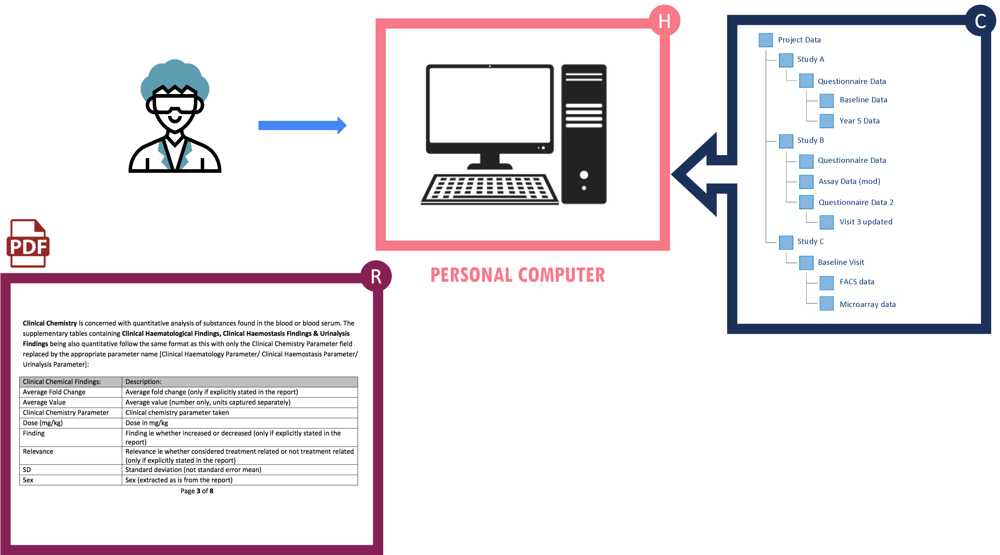
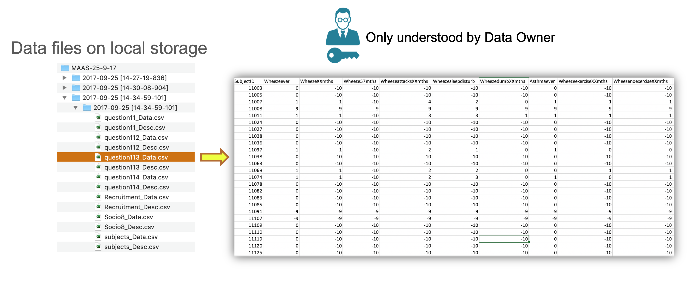

# Level 0

## Description

Level 0 is a reference level representing a **state of data** that is missing one or more fundamental FAIR requirements. Data at this level has diminished potential for reuse as it does not meet the minimum set of requirements to be findable or accessible beyond the lifetime of its original research project.

## Indicators



{{indicator.content}}


## Example

 

An example of Level 0 data would be a stand-alone dataset, for example from a PhD project, that is not intended for reuse beyond the immediate project. Data are stored in a non-accessible environment such as a personal computer and metadata are likely in non-machine readable format such as PDFs or even hand-written notes.

No explicit metadata is available to describe directory structures, file types, content or variables. As a result, the dataset can only be understood by the data owner.

While identifiers such as file names or data identifiers may be unique within the dataset or project, no effort has been made to make them globally unique or resolvable.

 

