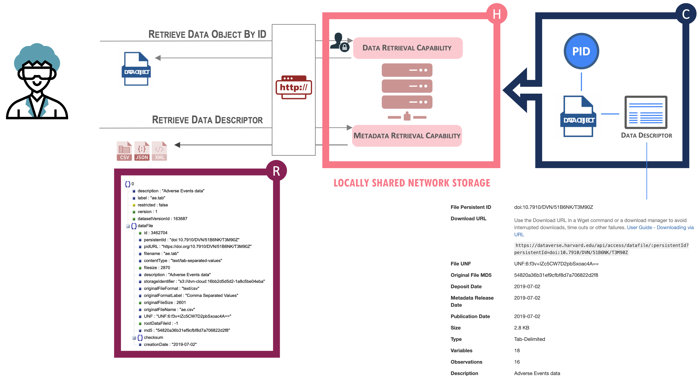
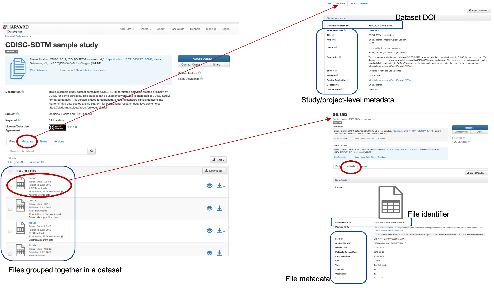

# Level 1

## Description

In level 1, data is identifiable as individual generic data objects that are described by generic metadata elements. Hosting environment offers limited retrieval capabilities.

This level prescribes the entry level requirements that all the higher levels will build up upon. It establishes basic requirements to enable 'Findability', 'Accessibility' with basic descriptive metadata that enables data users to interpret and understand the data object.

The first step to be at Maturity Level 1 is to define and identify the data object that is expected to be shared and re-used (i.e., the FAIR data object). Notice this level is referring to a Data Object rather than a Dataset. This is to imply that data at this level includes both structured and unstructured data. 

## Indicators



{{indicator.content}}


## Example

A Level 1 dataset might involve the publication of analysis-related data in a general purpose repository such as Harvard Dataverse, Zenodo or Figshare, making them findable, citable and available for re-use for the purpose of future analysis validation. Deposition in a repository will give the dataset a **DOI, accession number or other globally unique, persistent and resolvable identifier**. Repositories generally require some **minimal metadata to describe both the high-level content of the submission and the individual file types**. Indexing this information allows for **searching and retrieval** based on a number of facets.

