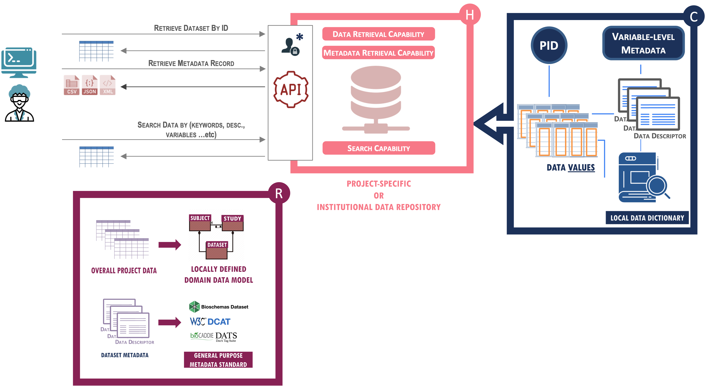
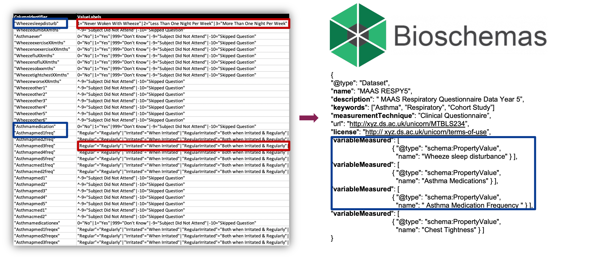
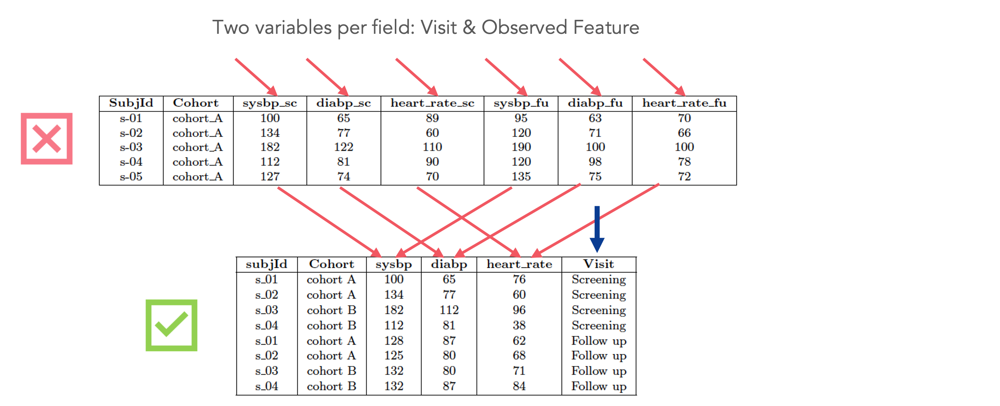

# Level 2

## Description

Level 2 aims to enhance the usability of a project, or a study's structured data, which often are represented by multiple related datasets. Different projects usually have their own data model and collect different subsets of clinical, molecular, imaging or other data. The FAIRplus-DSM model distinguishes between structured data, unstructured data, and data objects in a project. Structured data include subject-based clinical data, sample-based assay data and other data associated with the data schema. Therefore, indicators at this level, refer to the FAIR Data Object as the **Dataset** indicating more requirements related to the structural metadata of the Dataset, namely the **Dataset Fields** and the corresponding **Dataset Field Values**. 

This level of maturity aims to increase the FAIRness level of structured data by focusing on Dataset-level structural metadata and Project-level contextual metadata. 

This level of maturity is aimed at data hosted within project-based data repositories, general purpose data repositories or data catalogues.
   

## Indicators



{{indicator.content}}


## Example

In order to comply with level 2 maturity requirements, a dataset needs to conform to a locally defined domain model such as a project data dictionary or standard generic domain model such as W3C's DCAT or Bioschemas. This allows data values to be mapped uniformely using standardised terms for both variables and valuesl, where possible.

Where appropriate, datasets should also conform to "Tidy Data Principles", ie each column and field should represent a single variable. In the example shown below, the initial data encodes both the measured variable (eg sysbp - systolic blood pressure) and the visit during which the measurement was taken (eg sc - screening). After transformation, the measured variables have been reduced from 6 to 3 columns (one for each variable) and a further column added to represent the visit. This makes querying and filtering the data much easier. 

In terms of hosting, level 2 compliant datasets would be hosted in project-specific or institutional data repositories that provide all the 