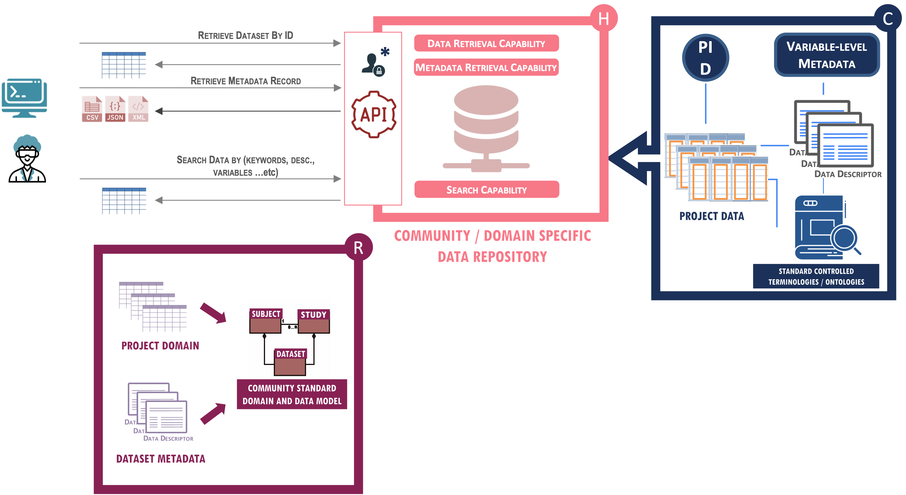
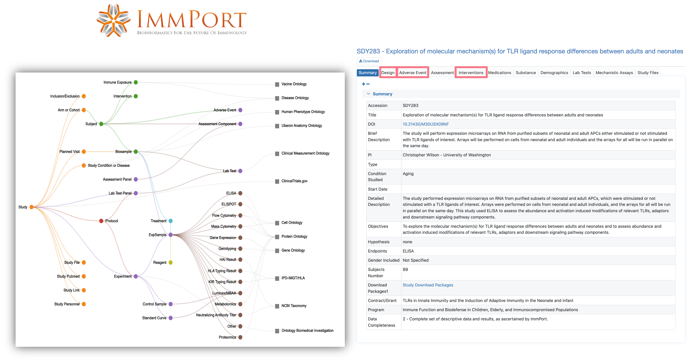

# Level 3

## Description

This level of maturity is defined at **community level**. The data at this level complies with community standard domain models, terminologies and formats, and is hosted in an environment offering searching and retrieval capabilities.

## Indicators



{{indicator.content}}


## Example

Level 3 compliant datasets are generally deposited in a community-specific data portal such as ImmPort for immunology research data, ENA for sequencing data or BioModels for mathematical models of biological and biomedical systems. Such repositories usually have a defined data model adapted to the needs of the domain or community and that defines the minimum metadata that needs to be collected, links between data types or data objects, where applicable, and domain-relevant terminologies and ontologies with which data and metadata should be annotated.

Conformance to a well-defined community model such as the ImmPort one shown below is essential for the integration of different datasets in the same domain.

