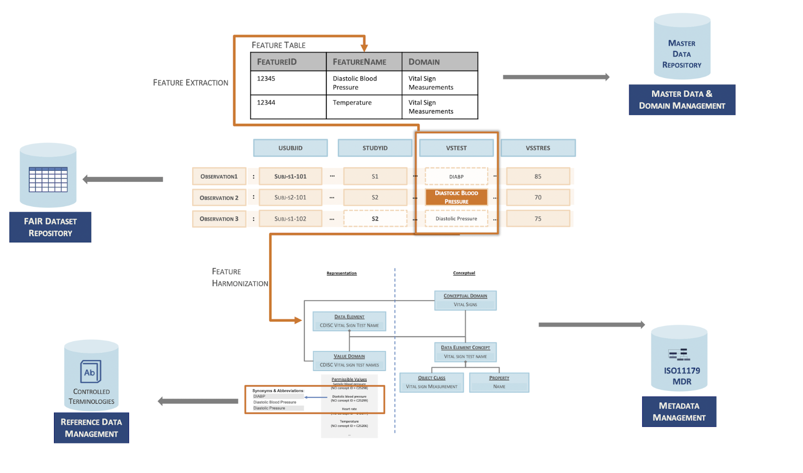

# Level 5

## Description

This level of maturity is defined at **enterprise level**. Data at level 5 is optimally managed at the most granular level in an environment offering data governance, master data and reference data management capabilities.

## Level 5 Data Example

## FAIR-DSM Level 5 Indicators



{{indicator.content}}

