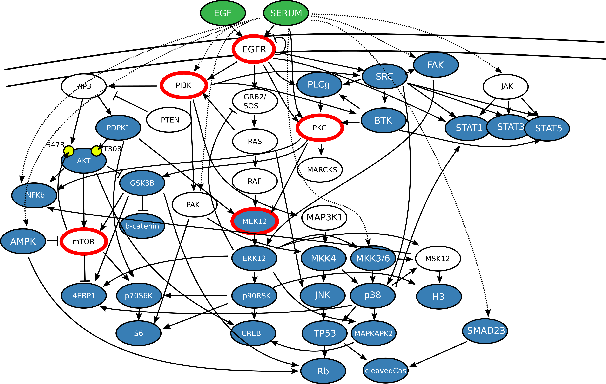
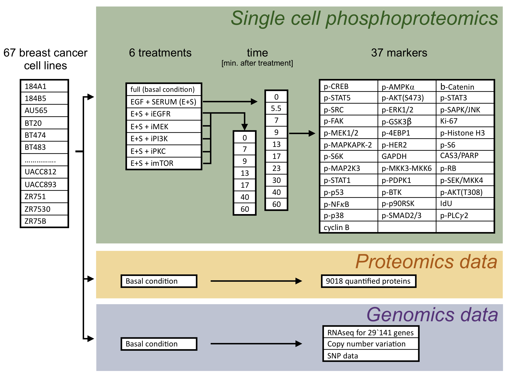
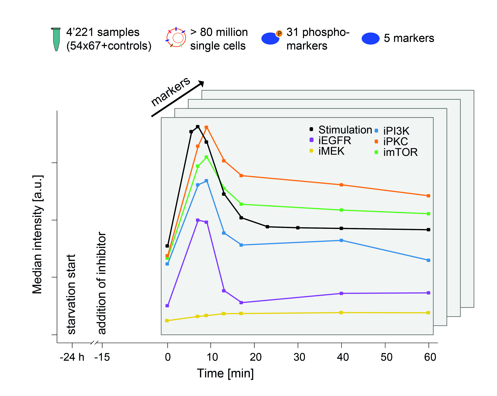
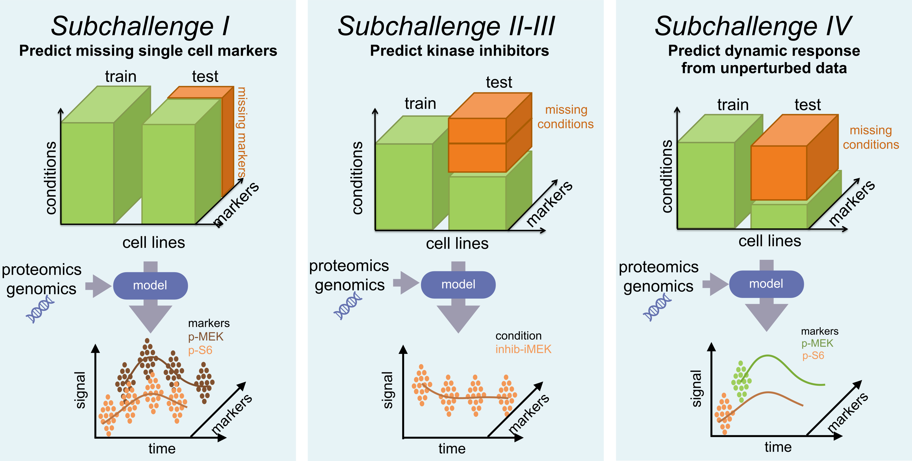
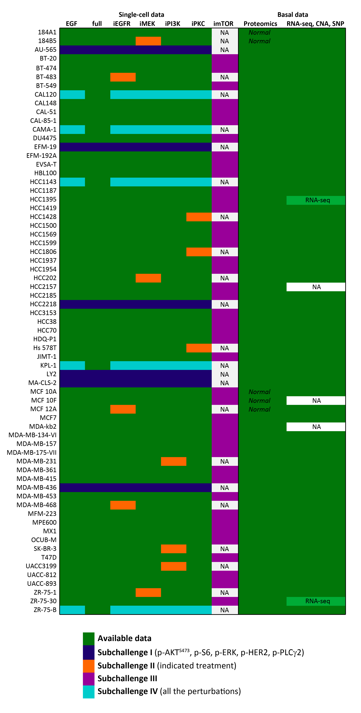

## Overview
The aim of this crowd-based DREAM Challenge is to understand cell line specific signaling beyond the population-level response and to gain insight into the factors that drive heterogeneity of cell signaling. Through this challenge we expect to gain insight into how cells process signals and which population-level measurements (proteomic, transcriptomic, and genomic measurements are provided) help to understand differences among cell lines.

_Figure 1. Overview on the signaling network that was studied. The nodes represent protein kinases, phosphatases, and small molecules. They are connected by directed, signed edges denoting reported interactions. Green nodes are the stimuli; nodes highlighted with red edge show the potential target of the inhibitors. Nodes that were measured in the experiments are shown in blue (some measured markers are not shown: p.HER2, IdU, Cyclin B, GAPDH, Ki67, cleaved Caspase). Regular arrows indicate activation, T-shaped arrows show inhibitory effects, based on prior knowledge obtained from the pathway resource Omnipath Database (www.omnipathdb.org) using manual assessment._

## Challenge dataset
The generated dataset comprises single-cell mass cytometry measurements of 37 markers (31 phospho-sites, 4 total protein levels, the initiation of apoptosis and novel incorporation of DNA as measured by cleaved Cas and PARP, and IdU, respectively) at 0, 5.5, 7, 9, 13, 17, 23, 30, 40, and 60 minutes upon EGF and serum stimulation in the presence or absence of five well-known kinase inhibitors, see Figure 1 and 2 and Experimental Details.

_Figure 2. Summary of the challenge data. Single-cell mass cytometry measurements include each of the 67 breast cancer cell lines, measured in 6 conditions: stimulation with EGF and SERUM and stimulation with combinations of inhibitors. The cells were measured right before treatment (time 0) and 6-9 times after perturbation. In each of the conditions, all the 37 markers were measured in single cells (approx. 1000-20`000 single cells per conditions). Further, the proteomics of each of the 67 was measured in normal growing conditions. For the majority of the cell-lines RNA sequencing (RNA-seq), Copy Number Variation (CNV) and Single Nucleotide Polymorphism (SNP) data is also available._

_Figure 3. Single cell perturbation experimental setup overview. Schematic representation of the perturbation experiment._

Mass cytometry is a recent extension of flow cytometry where fluorophore reporters on antibodies are replaced by pure metal isotopes and spectroscopy by mass spectrometry as signal readout. During the measurement, each stained single cell is vaporized, atomized, and ionized into an ion cloud that is quantitatively analyzed by time-of-flight mass spectrometry (Bandura et al. 2009; Bendall et al., 2011). As a result, mass cytometry allows the simultaneous quantification of multiple proteins and phosphorylation sites on the single-cell level with high-throughput (Lun et al., 2017; Lun et al., 2019). A barcoding strategy allows the simultaneous measurements of hundreds of samples, eliminating batch effects, and increasing throughput (Bodenmiller et al., 2012; Zivanovic et al., 2013; Zunder et al., 2015).

## Challenge questions
Within the scope of the Challenge, we invite participants to provide single-cell predictions for four questions with gradually increasing difficulty (see also Figure 4):

1. [Subchallenge I](/docs/challenge_overview/subchallenges_i_iii/#subchallenge-i-predict-missing-markers-at-the-single-cell-level): the Challenge starts by predicting missing markers of kinase activity in single cells.
2. [Subchallenge II](/docs/challenge_overview/subchallenges_i_iii/#subchallenge-ii-predict-how-single-cells-respond-to-different-kinase-inhibitors): we ask the participants to predict time-dependent single-cell response upon kinase inhibitor treatments for a known perturbation.
3. [Subchallenge III](/docs/challenge_overview/subchallenges_i_iii/#subchallenge-iii-predict-how-single-cells-respond-to-a-novel-kinase-inhibitor): the participants predict single-cell response to an mTOR-inhibiting perturbation, for which no data is available.
4. [Subchallenge IV](..//docs/challenge_overview/subchallenge_iv): Finally, we ask the participants to predict perturbation response (on population level) for cell-lines for which only unperturbed data is available. Here, the participants can rely on the unperturbed data of the cell-lines and the perturbation data from other cell lines.

The resulting predictions will then be scored relative to the ground truth (measurements within the same batch but not present in the training dataset).
For more information on the scoring, see [here](../../scoring/scoring_overview).

_Figure 4. Overview of the subchallenges._

## Challenge Phases
he Challenge will consist of three phases: open/training, leaderboard, and validation.

During the *open/training* phase, participants will develop and train their models on the training data set: a subset of the perturbation mass cytometry data and the population-based measurements (ratio of protein abundance, transcript levels, single nucleotide polymorphisms (SNPs), copy number variants (CNVs)). We welcome submissions based on new or published methods and the integration of prior knowledge about the protein interaction network or other types of biological knowledge. No scores will be reported during this phase.

During the *leaderboard* phase, submitted single-cell predictions will be compared against the test dataset and scores will be reported on a public leaderboard. For each question/sub-question an associated and paired ground truth will be used to evaluate the predictions. Participants will have an opportunity to improve their models after each leaderboard round for a maximum of three scorable submissions per round.

During the *validation* phase, submitted predictions will be compared against the test dataset. Scores will NOT be reported on the public leaderboard and will NOT be reported in the emails. Participants can submit a maximum of three scorable submissions, we will consider the LAST submission as the final one. Models will be ranked according to their scores and top performers will be announced.

## Data availability for training and scoring
A simplified overview of the data is shown in Figure 5, see also Data Description. The different colours highlight the conditions where the data is available for model training (dark green) and conditions that are used to test the submitted models.

_Figure 5. Overview on the data usage in the different sub-challenges. The data provided is in green and the requested data for the different subchallenges in different colours. The full condition is grown growing in full media with no starvation. Missing data is in white and the normal cell lines used for calculating the ratio in the proteomic dataset are marked with “Normal”._

For the experimental details please refer to the [Data Description](../../../data) sections.

## References
- Bandura, D.R., Baranov, V.I., Ornatsky, O.I., Antonov, A., Kinach, R., Lou, X., Pavlov, S., Vorobiev, S., Dick, J.E., and Tanner, S.D. (2009). Mass Cytometry: Technique for Real Time Single Cell Multitarget Immunoassay Based on Inductively Coupled Plasma Time-of-Flight Mass Spectrometry. Anal. Chem. 81, 6813–6822.
- Bendall, S.C., Nolan, G.P., Roederer, M., and Chattopadhyay, P.K. (2012). A deep profiler’s guide to cytometry. Trends Immunol. 33, 323–332.
- Bodenmiller, B., Zunder, E.R., Finck, R., Chen, T.J., Savig, E.S., Bruggner, R. V., Simonds, E.F., Bendall, S.C., Sachs, K., Krutzik, P.O., et al. (2012). Multiplexed mass cytometry profiling of cellular states perturbed by small-molecule regulators. Nat. Biotechnol. 30, 858–867.
- Lun, X.-K., Zanotelli, V.R.T., Wade, J.D., Schapiro, D., Tognetti, M., Dobberstein, N., and Bodenmiller, B. (2017). Influence of node abundance on signaling network state and dynamics analyzed by mass cytometry. Nat. Biotechnol. 35, 164–172.
- Lun, X.-K., Szklarczyk, D., Saez-Rodriguez, J., Von Mering, C., and Correspondence, B.B. (2019). Analysis of the Human Kinome and Phosphatome by Mass Cytometry Reveals Overexpression-Induced Effects on Cancer-Related Signaling In Brief. Mol. Cell 74.
- Zivanovic, N., Jacobs, A., and Bodenmiller, B. (2013). A Practical Guide to Multiplexed Mass Cytometry. In Current Topics in Microbiology and Immunology, pp. 95–109.
- Zunder, E.R., Finck, R., Behbehani, G.K., Amir, E.-A.D., Krishnaswamy, S., Gonzalez, V.D., Lorang, C.G., Bjornson, Z., Spitzer, M.H., Bodenmiller, B., et al. (2015). Palladium-based mass tag cell barcoding with a doublet-filtering scheme and single-cell deconvolution algorithm. Nat. Protoc. 10, 316–333.

