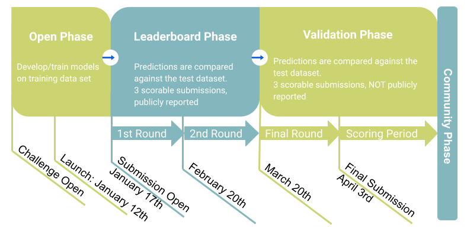

## Overview
Signaling underlines nearly every cellular event. Individual cells, even if genetically identical, respond to perturbation in different ways. This underscores the relevance of cellular heterogeneity, in particular in how cells respond to drugs. This is of high relevance since the fact that a subset of cells do not respond (or only weakly) to drugs can render this drug an ineffective treatment. In spite of its relevance to many diseases, comprehensive studies on the heterogeneous signaling in single cells are still lacking.

We have generated the, to our knowledge, currently largest single cell signaling dataset on a panel of 67 well-characterized breast cancer cell lines by mass cytometry (3’015 conditions, ~80 mio single cells, 38 markers; Bandura et al. 2009; Bendall et al., 2011; Bodenmiller et al., 2012; Lun et al., 2017; Lun et al., 2019). These cell lines are, among others, also characterized at the genomic, transcriptomic, and proteomic level (Marcotte et al., 2016).

We ask the community to use these measurements to predict the signaling responses of the cell lines to drug treatment at the single-cell level. Firstly, we ask to predict certain markers in specific single cells. Secondly, we ask to predict the time-dependent response of single cells upon treatment with drugs. Finally, we aim to predict the time-dependent response of cell lines for which only static, unperturbed data is given.

The methods developed to answer these questions will allow us to better understand the determinants that control single-cell signaling, the heterogeneity in drug response of cancer cells, and to push the limits of signaling modeling.

_Figure 1. Single cell perturbation experimental setup overview. Schematic representation of the perturbation experiment._

_Figure 2. Challenge questions_

## Timeline
The Challenge will consist of three phases: open/training, leaderboard, and validation.

During the **open/training** phase, participants will develop and train their models on the training data set. We welcome submissions based on new or published methods and the integration of prior knowledge about the protein interaction network or other types of biological knowledge. No scores will be reported during this phase.

During the **leaderboard phase**, submitted single-cell predictions will be compared against the test dataset and scores will be reported on a public leaderboard. For each question/sub-question an associated and paired ground truth will be used to evaluate the predictions. Participants will have an opportunity to improve their models after each leaderboard round for a maximum of three scorable submissions per round.

During the **validation phase**, submitted predictions will be compared against the test dataset. Scores will NOT be reported on the public leaderboard and will NOT reported in the emails. Participants can submit a maximum of three scorable submissions, we will consider the LAST submission as the final one. Models will be ranked according to their scores and top performers will be announced for each subchallenge.

_Figure 3. Challenge timeline_

| Milestone | Date |
| --------- | ---- |
| Registration Opens | August 2019 |
| Launch | August 20, 2019 |
| Submission Opens | 1st September, 2019 |
| Submission Closes | 15th November, 2019 |
| Winners Announced | TBD |

## Data Contributors
The single-cell phosphoproteomics data and the proteomics data was provided by the [Bodenmiller group, University of Zurich](https://www.dqbm.uzh.ch/en/research/groups/bodenmiller.html) and [Picotti group, ETH Zurich](https://imsb.ethz.ch/research/picotti.html), respectively.

The RNA-seq, CNV, and SNP data are published data (Marcotte et al., 2016).

## Journal Partners
We are pleased to announce that Nature Biotechnology supports the submission of an overview paper describing the " DREAM Single Cell Signaling in Breast Cancer Challenge" and broadly applicable insights that emerge from it. Publication in Nature Biotechnology will be contingent on a standard evaluation process including editorial assessment and peer review. Challenge participants' authorship in the resulting paper follows the guidelines given in the DREAM Principles.

## Incentives
### Manuscript Authorship
The top-performing teams will be invited to participate in the manuscript design and writing and will therefore be eligible for byline authorship. The author order will be determined by the organizers based on contribution to the final manuscript.

All individuals that participate in the Challenge and provide a complete final submission (including a method write up and code under an open source license) will be asked to be part of the Single Cell Signaling in Breast Cancer DREAM Consortium. The Consortium will be listed as a co-author on a manuscript describing the Challenge results.

### Competitive Phase
The Competitive Phase consists of four subchallenges, which are described in the Challenge Questions Section. One top-performing team will be identified for each of these subchallenges, with results posted on the leaderboard.

### Community Phase
The top-performing teams might be invited to participate in a Community Phase of the Challenge. Additionally, the challenge organizers may invite teams to participate in the Community Phase at their discretion (e.g., teams with methods that are particularly novel or that perform well in quantifying one or more particular phenotypes and/or subchallenges).

### DREAM Conference
The challenge organizers will invite representatives from the top-performing teams in each subchallenge, and others at their discretion, to present at the DREAM track of the DREAM Conference or the RECOMB Conference; travel support might be provided on behalf of the Challenge Organizers if available.

**NOTE:** Byline authorship, DREAM Conference invitation, and any additional awards are predicated on final models performing better than the published baseline models. Employees, contractors, students, or agents of any of the challenge organizers and anyone who had access to any or all of the validation/scoring dataset not previously made public are ineligible for challenge participation and will be disqualified from the challenge and any related incentives.

## Challenge Organisers

| Name | Institution | Role |
|------|-------------|------|
| [Marco Tognetti](https://imsb.ethz.ch/research/picotti/PeoplePicotti/marco-tognetti.html) | University Zurich & ETH Zurich | Challenge Organisation |
| [Bernd Bodenmiller](https://www.dqbm.uzh.ch/en/research/groups/bodenmiller.html) | University Zurich | Challenge Organisation |
| [Attila Gabor](http://saezlab.org/person/attila-gabor/) | Heidelberg University | Challenge Organisation |
| [Julio Saez-Rodriguez](http://saezlab.org/) | Heidelberg University | Challenge Organisation |
| [Paola Picotti](https://imsb.ethz.ch/research/picotti/PeoplePicotti/paola-picotti.html) | ETH Zurich | Challenge Organisation |
| Verena Chung | Sage Bionetworks | Challenge Infrastructure |
| Thomas Yu | Sage Bionetworks | Challenge Infrastructure |
| Julie Bletz | Sage Bionetworks | Challenge Infrastructure |

## Acknowledgements
The organisers appreciate the help and feedback from [Jovan Tanevski](http://saezlab.org/person/jovan-tanevski/), [Bence Szalai](https://www.linkedin.com/in/bence-szalai-ba403878/?locale=de_DE), [Ricardo Ramirez-Flores](http://saezlab.org/person/ricardo-o-ramirez-flores/), and [Natalie de Souza](https://imsb.ethz.ch/research/picotti/PeoplePicotti/natalie-de-souza.html) .

## References

- Bandura, D.R., Baranov, V.I., Ornatsky, O.I., Antonov, A., Kinach, R., Lou, X., Pavlov, S., Vorobiev, S., Dick, J.E., and Tanner, S.D. (2009). Mass Cytometry: Technique for Real Time Single Cell Multitarget Immunoassay Based on Inductively Coupled Plasma Time-of-Flight Mass Spectrometry. Anal. Chem. 81, 6813–6822.
- Bendall, S.C., Nolan, G.P., Roederer, M., and Chattopadhyay, P.K. (2012). A deep profiler’s guide to cytometry. Trends Immunol. 33, 323–332.
- Bodenmiller, B., Zunder, E.R., Finck, R., Chen, T.J., Savig, E.S., Bruggner, R. V., Simonds, E.F., Bendall, S.C., Sachs, K., Krutzik, P.O., et al. (2012). Multiplexed mass cytometry profiling of cellular states perturbed by small-molecule regulators. Nat. Biotechnol. 30, 858–867.
- Marcotte, R., Sayad, A., Brown, K.R., Sanchez-Garcia, F., Reimand, J., Haider, M., Virtanen, C., Bradner, J.E., Bader, G.D., Mills, G.B., et al. (2016). Functional Genomic Landscape of Human Breast Cancer Drivers, Vulnerabilities, and Resistance. Cell 164, 293–309.
- Lun, X.-K., Zanotelli, V.R.T., Wade, J.D., Schapiro, D., Tognetti, M., Dobberstein, N., and Bodenmiller, B. (2017). Influence of node abundance on signaling network state and dynamics analyzed by mass cytometry. Nat. Biotechnol. 35, 164–172.
- Lun, X.-K., Szklarczyk, D., Gabor, A., Saez-Rodriguez, J., Von Mering, C., and Correspondence, B.B. (2019). Analysis of the Human Kinome and Phosphatome by Mass Cytometry Reveals Overexpression-Induced Effects on Cancer-Related Signaling In Brief. Mol. Cell 74.
