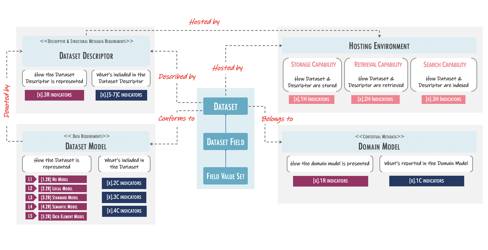

# FAIRplus Dataset Maturity (DSM) Model  

The FAIRplus-DSM model is intended as a comprehensive reference model for state-of-FAIRness improvement in research datasets. Based on the FAIR guiding principles, the DSM model defines and classifies requirements that constitute an incremental path towards improving FAIRness level for a given research dataset.

## FAIRplus-DSM Conceptual Model

 

According to the FAIRplus-DSM, a Dataset is the unit of Data that is defined for the purpose of FAIR sharing and reuse. Three different levels of data granularity are referred to by the FAIR-DSM model indicators: Dataset level, Dataset Field Level, and Value-set Level. For each Dataset, a Dataset Descriptor (metadata object) is associated with it. The model includes indicators that guide the creation of Dataset Descriptors for content and representation at different levels of maturity. Similarly, the model includes indicators that guide the modeling and inclusion of FAIR-related requirements in the dataset \(referred to as Data Model\), which is part of what the Dataset Descriptor includes to describe the dataset.

A Dataset is also contextualised by being associated with a Domain Model, which provides the necessary information to understand and interpret the dataset\(s\) content.  

## The three dimensions of FAIR Data Maturation  

  

The model is comprised of three categories of requirements as described below. These requirements are prescribed by a set of [indicators](docs/Indicators.md) defined for each level.

- **Content-related**: What is reported in the Dataset \(data\) & the Dataset Descriptor \(metadata\).
- **Representation and format**: How the data object & metadata object are represented and formatted.
- **Hosting environment capabilities**: What capabilities of the hosting environment that enables and supports the use of FAIR data.

## Maturity levels  

The FAIRplus-DSM model presents five levels of FAIR. Each level is characterised by by increasing requirements across the three categories of the FAIR requirements. The diagram below provides a summary description and perspective for each level.   

