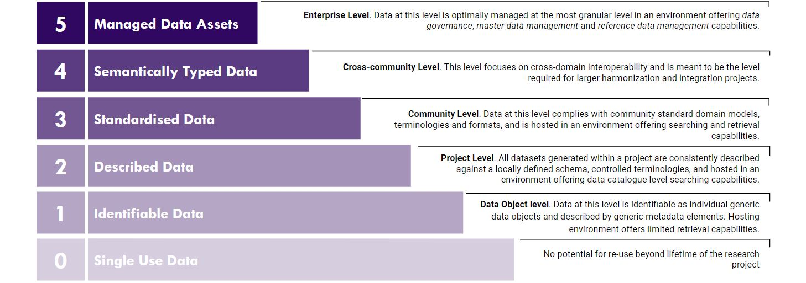

## FAIRplus Dataset Maturity Model (DSM)

A life-sciences domain-specific, indicator-based dataset maturity model to serve as both an assessment and a maturation guide towards FAIR maturity of a dataset. The levels within this Maturity Model contain the metadata required to achieve a certain level of Dataset FAIRness (as outlined in the FAIR Metadata Requirements Model) along with the FAIR benefits achieved at each level.

## The three dimensions of FAIR Data Maturation

- **Content-related**: What is reported in the dataset & the metadata.
- **Representation and format**: How the data object & metadata object are represented and formatted.
- **Hosting environment capabilities**: What capabilities of the hosting environment that enables and supports the use of FAIR data.

## Maturity levels

## Maturity Model

| Categories | Level 0 | Level 1 | Level 2 | Level 3 | Level 4 | Level 5 |
| ---------- | ------- | ------- | ------- | ------- | ------- | ------- |
| **Content** | • The Data object or dataset as an entity is undefined or undescribed.  • No metadata available. | • Data object is defined and it is assigned a locally unique and persistent identifier.  • Metadata for the data object includes generic descriptive elements of the data object as a whole. | • Each study variable is reported in a single dataset field / variable.  • Metadata includes dataset field/variable level metadata.  • Data values are standardized against a locally defined dictionary of terms within and across datasets.  • Metadata contains access information for the data. | • Data values are standardized against community standard controlled vocabularies and/or ontologies.  • Metadata includes license information under which data can be reused.  • The Dataset object is assigned a globally unique and persistent identifier. | • Dataset(s) are semantically typed.  • Dataset(s) fields are semantically typed.  • Master Data Entities across all datasets are defined.  • Relevant attributes are provided to allow reuse of the data between communities. | • Domain model entities are defined and harmonized against enterprise managed master data entities.  • Field/Variable Level data is linked and harmonized against enterprise managed Reference Data.  • Metadata includes provenance information according to a cross-community language. |
| **Representation and format** | • No formal definition or representation of metadata.  • Metadata not available in machine readable format. | • Representation of metadata conforms to a locally defined model/schema.  • Metadata available in a machine-readable format. | • Metadata describing project datasets conforms to a Defined Standard Model.  • Overall project/study data representation uniformly conforms to a locally defined (project-defined) data model or schema providing contextual information about the relationships between data content across datasets.  • Dataset(s) available in machine readable format.  | • Overall project/study data representation conforms to a community defined standard domain model.  • Dataset(s) available in a structural representation conforming to a community data exchange standard model.  • Dataset(s) available in machine readable community standard format relevant to the adopted domain and data model.  | • Metadata is represented in a semantic machine interpretable form.   • Master entity models are formally represented.  | • Data-linked Data Elements are represented and formatted in a community standard model/format.  • Data-linked controlled terminologies and ontologies are formatted and represented by community standards.  |
| **Hosting Environment Capabilities** | • Data or metadata is hosted in non-accessible storage and only retrievable by a single or limited users.  • Data or metadata hosted in an accessible resource but with no retrieval capability.  | • Data object and its metadata record are indexed and retrievable via its globally unique and persistent identifier by a standardized communication protocol.  • The standardized communication protocol for data / metadata retrieval is open, free and universally implementable.  • If legally required, the hosting environment offers authentication and authorisation capabilities.  | • Data and Metadata exchange format is retrieved using API technologies.  • Metadata is registered or indexed in a searchable resource. Data can be retrieved via its metadata descriptive elements.  | • Data content is searchable. (e.g. data is retrieable via queries for standarised field names, ontology or controlled terms reported in the datasets)  • The hosting environment is a public / controlled-access repository.  • The hosting environment offers data archiving capability.  • The hosting environment offers version control capability.  | • Cross-study data is queryable via harmonized master data entities and their attributes.  | • Hosting Environment implements Master Data Management Capability.  • Hosting Environment implements Reference Data Management Capability.  • Hosting Environment implements Data Governance Capability.  |
