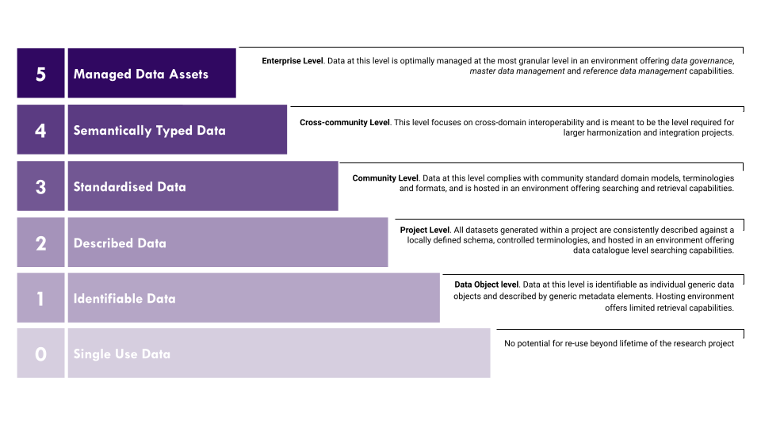

## FAIRplus Dataset Maturity Model (DSM)

A life-sciences domain-specific, indicator-based dataset maturity model to serve as both an assessment and a maturation guide towards FAIR maturity of a dataset. The levels within this Maturity Model contain the metadata required to achieve a certain level of Dataset FAIRness (as outlined in the FAIR Metadata Requirements Model) along with the FAIR benefits achieved at each level.

## The three dimensions of FAIR Data Maturation

- **Content-related**: What is reported in the dataset & the metadata.
- **Representation and format**: How the data object & metadata object are represented and formatted.
- **Hosting environment capabilities**: What capabilities of the hosting environment that enables and supports the use of FAIR data.

## Maturity levels

## Maturity Model

