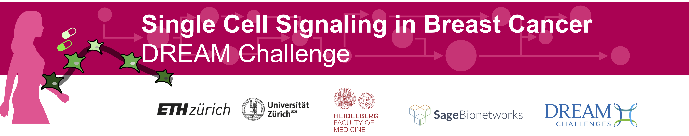
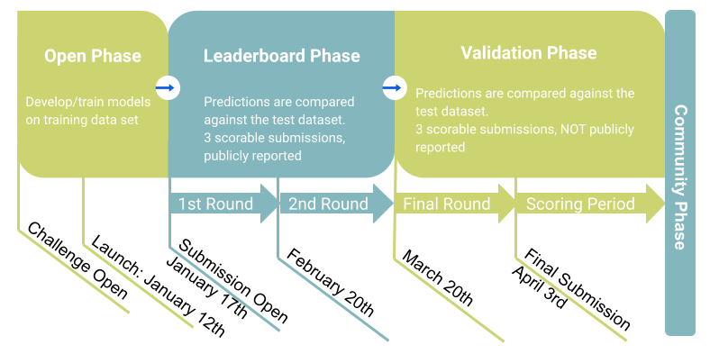

## Overview

Paediatric cancer is among the major causes of death in young children. One of the most prevalent paediatric tumor types is neuroblastoma which is often diagnosed in very young children and originates in the developing sympathetic nervous system. Despite recent advances in the neuroblastoma treatment, children diagnosed with high-risk neuroblastoma have 5-year survival rates of only 50%.

One of the hurdles for improving treatment is the genetic and molecular heterogeneity of neuroblastoma tumors. This heterogeneity means that not all neuroblastoma tumors will react similarly to drug treatment, especially for drugs designed against very particular targets.  

To investigate this heterogeneity we have available in vitro cell line models that were established from neuroblastoma tumors. A drawback of these (so-called classical) cell lines is that they are grown in conditions that are very different from a tumor. Organoids are an attempt to overcome these short-comings. They are grown in conditions that more closely resemble the in vivo tumor situation.  

To better understand the interaction between neuroblastoma heterogeneity and drug response, we subjected multiple neuroblastoma derived cell lines and organoids to a large panel of drugs (many of which are not yet used in current treatment) and determined their sensitivity to these drugs. At the same time gene and protein expression profiles of these cell lines and organoids were measured. This opens up the possibility to link the expression of genes and proteins to the drug response and build predictive models. The ultimate aim would be to use these models to predict sensitivity of neuroblastoma tumors in patients to help clinicians select the treatment best suited to the individual patient.

## Timeline
The Challenge will consist of 3 phases: open/training, leaderboard, and validation.

During the **open/training phase**, participants will develop and train their models on the training data set. We welcome submissions based on new or published methods and the integration of any type of biological knowledge. No scores will be reported during this phase.

During the **leaderboard phase**, submitted predictions/models will be compared against the test dataset and scores will be reported on a public leaderboard. For each question/sub-question an associated and paired ground truth will be used to evaluate the predictions. Participants will have an opportunity to improve their models after each leaderboard round for a maximum of three scorable submissions per round.
These submissions will NOT be considered for the final scoring.

During the **validation phase**, submitted predictions will be compared against the test dataset. Scores will NOT be reported on the public leaderboard, but they will be reported by email. Participants can submit a maximum of three scorable submissions, and the LAST submission will be considered as the final one. We will consider the LAST submission as the final one. If you want to use the last submission from the leaderboard phase, please submit it again. Models will be ranked according to their scores and top performers will be announced for each subchallenge. Predictions MUST be completed with a writing up of the method and the code SHOULD be available.

_Figure 3. Challenge timeline_

| Milestone | Date |
| --------- | ---- |
| Registration Opens | December 2021 |
| Launch | 12th January 2022 |
| Submission Opens | 17th January 2022 |
| Submission Closes | 3rd April 2022 |
| Winners Announced | TBA |

## Data Contributors
The RNA-seq neuroblastoma organoids data and drug screen data was provided by the [Molenaar group, Princess Máxima Center](https://research.prinsesmaximacentrum.nl/en/research-groups/molenaar-group).

## Journal Partners
TBA

## Incentives
### Manuscript Authorship
The top-performing teams will be invited to participate in the manuscript design and writing and will therefore be eligible for byline authorship. The author order will be determined by the organizers based on contribution to the final manuscript.

All individuals that participate in the Challenge and provide a complete final submission (including a method write up and code under an open source license) will be asked to be part of the Cell-lines to Organoids DREAM Consortium. The Consortium will be listed as a co-author on a manuscript describing the Challenge results.

### Competitive Phase
The Competitive Phase consists of two subchallenges, which are described in the Challenge Questions Section. One top-performing team will be identified for each of these subchallenges, with results posted on the leaderboard.

### Community Phase
The top-performing teams might be invited to participate in a Community Phase of the Challenge. Additionally, the challenge organizers may invite teams to participate in the Community Phase at their discretion (e.g., teams with methods that are particularly novel or that perform well in the subchallenges).

### DREAM Conference
The challenge organizers will invite representatives from the top-performing teams in each subchallenge, and others at their discretion, to present at the DREAM track of the DREAM Conference or the RECOMB Conference.

**NOTE:** Byline authorship, DREAM Conference invitation, and any additional awards are predicated on final models performing better than the published baseline models. Employees, contractors, students, or agents of any of the challenge organizers and anyone who had access to any or all of the validation/scoring dataset not previously made public are ineligible for challenge participation and will be disqualified from the challenge and any related incentives.

## Challenge Organisers

| Name                                                                                                | Institution                                                                    | Role                     |
|-----------------------------------------------------------------------------------------------------|--------------------------------------------------------------------------------|--------------------------|
| [Sander van Hooff](https://research.prinsesmaximacentrum.nl/en/team-members/sander-van-hooff)       | [Princess Máxima Center](https://www.prinsesmaximacentrum.nl/en)               | Challenge Organisation   |
| [Jan Molenaar](https://research.prinsesmaximacentrum.nl/en/team-members/jan-molenaar)               | [Princess Máxima Center](https://www.prinsesmaximacentrum.nl/en)               | Challenge Organisation   |
| [Qing Zhong](https://www.cmrijeansforgenes.org.au/researchers/qing-zhong)                           | [Children’s Medical Research Institute](https://www.cmrijeansforgenes.org.au/) | Challenge Organisation   |
| [Phil Robinson](https://www.cmrijeansforgenes.org.au/researchers/phil-robinson)                     | [Children’s Medical Research Institute](https://www.cmrijeansforgenes.org.au/) | Challenge Organisation   |
| [Heinz Köeppl](https://www.bcs.tu-darmstadt.de/team_sos/koepplheinz_sos.en.jsp)                     | [Technical Darmstadt University](https://www.etit.tu-darmstadt.de/)            | Challenge Organisation   |
| [Rosa Hernansaiz-Ballesteros](https://saezlab.org/person/rosa-hernansaiz-ballesteros/)              | [Heidelberg University](https://www.uni-heidelberg.de/en)                      | Challenge Organisation   |
| [Attila Gabor](http://saezlab.org/person/attila-gabor/)                                             | [Heidelberg University](https://www.uni-heidelberg.de/en)                      | Challenge Organisation   |
| [Julio Saez-Rodriguez](https://saezlab.org/person/julio-saez-rodriguez/)                            | [Heidelberg University](https://www.uni-heidelberg.de/en)                      | Challenge Organisation   |
| Mario Failli                                                                                        | [Telethon Institute of Genetics and Medicine (TIGEM)](https://www.tigem.it/)   | Challenge Organisation   |
| [Diego di Bernardo](https://www.tigem.it/research/research-faculty/di-bernardo)                     | [Telethon Institute of Genetics and Medicine (TIGEM)](https://www.tigem.it/)   | Challenge Organisation   |
| [Jannis Born](https://researcher.watson.ibm.com/researcher/view.php?person=zurich-JAB)              | [IBM Research Zurich](https://www.zurich.ibm.com/)                             | Challenge Organisation   |
| Nikita Janakarajan                                                                                  | [IBM Research Zurich](https://www.zurich.ibm.com/)                             | Challenge Organisation   |
| [Maria Rodriguez Martinez](https://researcher.watson.ibm.com/researcher/view.php?person=zurich-MRM) | [IBM Research Zurich](https://www.zurich.ibm.com/))                            | Challenge Organisation   |
| [Asier Gonzalez-Uriarte](https://www.bsc.es/gonzalez-uriarte-asier)                                 | [Barcelona Supercomputer Center](https://www.bsc.es/)                          | Challenge Infrastructure |
| [Laura Portell Silva](https://www.bsc.es/portell-silva-laura)                                       | [Barcelona Supercomputer Center](https://www.bsc.es/)                          | Challenge Infrastructure |
| [Alejandro Canosa](https://www.bsc.es/canosa-alejandro)                                             | [Barcelona Supercomputer Center](https://www.bsc.es/)                          | Challenge Infrastructure |
| [Laura Rodriguez](https://www.bsc.es/rodriguez-navas-laura)                                         | [Barcelona Supercomputer Center](https://www.bsc.es/)                          | Challenge Infrastructure |
| [Salvador Capella](https://www.bsc.es/capella-gutierrez-salvador)                                   | [Barcelona Supercomputer Center](https://www.bsc.es/)                          | Challenge Infrastructure |

## Acknowledgements
The organisers appreciate the help and feedback from [Jovan Tanevski](http://saezlab.org/person/jovan-tanevski/), [Bence Szalai](https://www.linkedin.com/in/bence-szalai-ba403878/?locale=de_DE), [Ricardo Ramirez-Flores](http://saezlab.org/person/ricardo-o-ramirez-flores/), and [Natalie de Souza](https://imsb.ethz.ch/research/picotti/PeoplePicotti/natalie-de-souza.html) .

## References

- Bandura, D.R., Baranov, V.I., Ornatsky, O.I., Antonov, A., Kinach, R., Lou, X., Pavlov, S., Vorobiev, S., Dick, J.E., and Tanner, S.D. (2009). Mass Cytometry: Technique for Real Time Single Cell Multitarget Immunoassay Based on Inductively Coupled Plasma Time-of-Flight Mass Spectrometry. Anal. Chem. 81, 6813–6822.
- Bendall, S.C., Nolan, G.P., Roederer, M., and Chattopadhyay, P.K. (2012). A deep profiler’s guide to cytometry. Trends Immunol. 33, 323–332.
- Bodenmiller, B., Zunder, E.R., Finck, R., Chen, T.J., Savig, E.S., Bruggner, R. V., Simonds, E.F., Bendall, S.C., Sachs, K., Krutzik, P.O., et al. (2012). Multiplexed mass cytometry profiling of cellular states perturbed by small-molecule regulators. Nat. Biotechnol. 30, 858–867.
- Marcotte, R., Sayad, A., Brown, K.R., Sanchez-Garcia, F., Reimand, J., Haider, M., Virtanen, C., Bradner, J.E., Bader, G.D., Mills, G.B., et al. (2016). Functional Genomic Landscape of Human Breast Cancer Drivers, Vulnerabilities, and Resistance. Cell 164, 293–309.
- Lun, X.-K., Zanotelli, V.R.T., Wade, J.D., Schapiro, D., Tognetti, M., Dobberstein, N., and Bodenmiller, B. (2017). Influence of node abundance on signaling network state and dynamics analyzed by mass cytometry. Nat. Biotechnol. 35, 164–172.
- Lun, X.-K., Szklarczyk, D., Gabor, A., Saez-Rodriguez, J., Von Mering, C., and Correspondence, B.B. (2019). Analysis of the Human Kinome and Phosphatome by Mass Cytometry Reveals Overexpression-Induced Effects on Cancer-Related Signaling In Brief. Mol. Cell 74.
