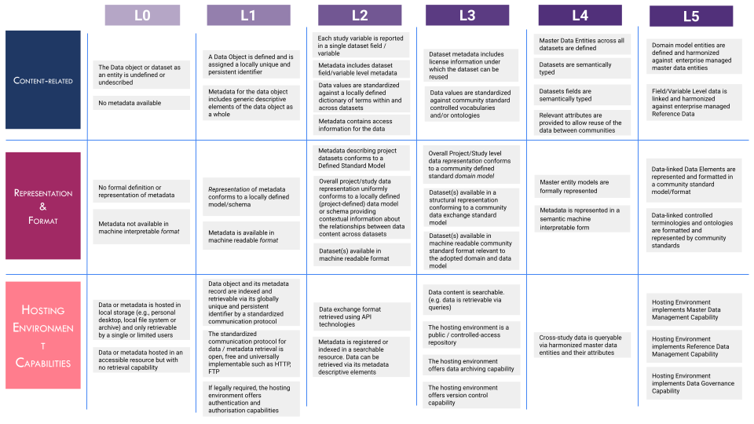

## FAIRplus Dataset Maturity (DSM) Model  

The FAIRplus-DSM model is intended as a comprehensive reference model for state-of-FAIRness improvement in research datasets. Based on the FAIR guiding principles, the DSM model defines and classifies requirements that constitute an incremental path towards improving FAIRness level for a given research dataset.

## The three dimensions of FAIR Data Maturation  

  

The model is comprised of three categories of requirements as described below. These requirements are prescribed by a set of [indicators](docs/Indicators.md) defined for each level.

- **Content-related**: What is reported in the dataset & the metadata.
- **Representation and format**: How the data object & metadata object are represented and formatted.
- **Hosting environment capabilities**: What capabilities of the hosting environment that enables and supports the use of FAIR data.

## Maturity levels  

The FAIRplus-DSM model presents five levels of FAIR. Each level is characterised by by increasing requirements across the three categories of the FAIR requirements. The diagram below provides a summary description and perspective for each level.   

  

## Maturity Model   

The model is comprised of three categories of requirements. These requirements are prescribed by a set of indicators defined for each level. A Dataset is said to be at a given FAIR maturity level if it fulfills the requirements needed to pass that level. The model is broken down into 5 maturity levels from ‘Single Use Data’, with no potential for re-use, up to ‘Managed Data Assets’, which are optimally managed at an Enterprise level.   

